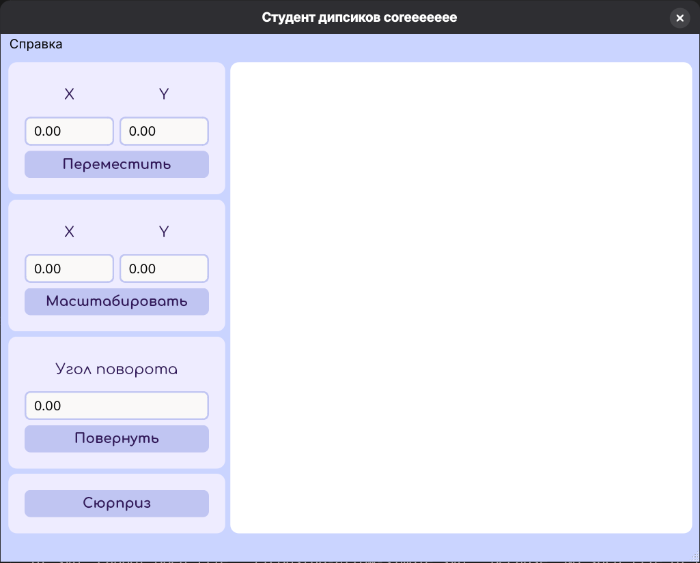
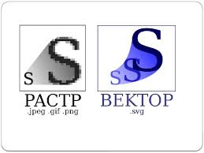
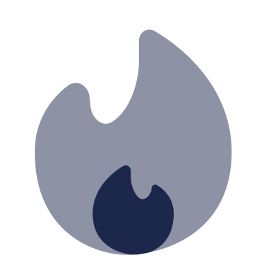

# Лабораторная работа №2

> [!IMPORTANT]
> Студент диспиков edition

## Условие 

Изобразить выбранную картинку с возможностью ее преобразований без потери качества. Выбранная картинка должна включать минимум 50 "опорных точек", одну кривую безье или эллипс. Запрещено использовать любые реализованные функции графической библиотеки, кроме:
* рисования точки
* рисования линии
* рисования примитивов

Цитата небезызвестного автора идеи:
```
Во второй лабораторной можно использовать любой примитив общего положения. И закраску. Безье можно, а вот общих эллипсов во фреймворках нет.
```

## Интерфейс



## Векторная графика

Фраза из условия задачи ```без потери качества``` отсылает нас к такой замечательной вещи, как векторная графика, в частности к векторному изображению (формат ```.svg```). В отличие от растрового, оно состоит не из сетки пикселей, а из совокупности координат опорных точек и, если рассуждать утрированно, параметров примитивов, которые их соединяют. Преимущество такого подхода очевидно вполне: оно не теряет качества при масштабировании. 



Ниже пример ```svg``` изображения, а также то, как оно представляется непосредственно кодом.



```svg
<?xml version="1.0" encoding="utf-8"?>
<svg width="800px" height="800px" viewBox="0 0 24 24" fill="none" xmlns="http://www.w3.org/2000/svg">
<path opacity="0.5" d="M12.8324 21.8013C15.9583 21.1747 20 18.926 20 13.1112C20 7.8196 16.1267 4.29593 13.3415 2.67685C12.7235 2.31757 12 2.79006 12 3.50492V5.3334C12 6.77526 11.3938 9.40711 9.70932 10.5018C8.84932 11.0607 7.92052 10.2242 7.816 9.20388L7.73017 8.36604C7.6304 7.39203 6.63841 6.80075 5.85996 7.3946C4.46147 8.46144 3 10.3296 3 13.1112C3 20.2223 8.28889 22.0001 10.9333 22.0001C11.0871 22.0001 11.2488 21.9955 11.4171 21.9858C11.863 21.9296 11.4171 22.085 12.8324 21.8013Z" fill="#1C274C"/>
<path d="M8 18.4442C8 21.064 10.1113 21.8742 11.4171 21.9858C11.863 21.9296 11.4171 22.085 12.8324 21.8013C13.871 21.4343 15 20.4922 15 18.4442C15 17.1465 14.1814 16.3459 13.5401 15.9711C13.3439 15.8564 13.1161 16.0008 13.0985 16.2273C13.0429 16.9454 12.3534 17.5174 11.8836 16.9714C11.4685 16.4889 11.2941 15.784 11.2941 15.3331V14.7439C11.2941 14.3887 10.9365 14.1533 10.631 14.3346C9.49507 15.0085 8 16.3949 8 18.4442Z" fill="#1C274C"/>
</svg>
```

Векторное изображение имеет и другие достоинства и недостатки, однако в контексте данной лабораторной работы нам это не интересно, поэтому я могу совершенно легально отправить искушенного читателя изучать статью по данной теме на [википедии](https://en.wikipedia.org/wiki/Vector_graphics). 

## Наши возможности в контексте Qt

Рассмотрим возможности Qt, которые мы можем (нам разрешили) использовать. Для начала поймем, что такое ```примитив общего положения```.

```
Примитив общего положения — это геометрический объект (прямая, плоскость, отрезок), расположенный в пространстве произвольно, то есть не параллельно и не перпендикулярно ни одной из плоскостей проекций. 
```

Зафиксируем. Qt предоставляет нам в свободное пользование следующие [функции](https://doc.qt.io/qt-6/qpainter.html):

|        Функция      | Тип |
|---------------------|-----|
| ⚠️ drawArc             | Рисуется на основе QRect, который не является примитивом общего пользования |
| ⚠️ drawChord           | Рисуется на основе QRect, который не является примитивом общего пользования |
| ✅ drawConvexPolygon   | Отрисовка выпуклого многоугольника |
| ❌ drawEllipse         | Эллипс рисуется относительно осей координат, т.е. не является примитивом общего положения |
| ❌ drawGlyphRun        | Не является примитивом |
| ❌ drawImage           | Не является примитивом |
| ✅ drawLine            | Отрисовка линии |
| ✅ drawLines           | Отрисовка линий |
| ✅ drawPath            | Рисование любых сложных линий (кривых Безье в том числе) |
| ❌ drawPicture         | Не является примитивом |
| ⚠️ drawPie             | Рисуется на основе QRect, который не является примитивом общего пользования |
| ❌ drawPixmap          | Не является примитивом |
| ❌ drawPixmapFragments | Не является примитивом |
| ✅ drawPoint           | Отрисовка точки |
| ✅ drawPoints          | Отрисовка точек |
| ✅ drawPolygon         | Отрисовка многоугольника |
| ✅ drawPolyline        | Отрисовка ломанной линии (последняя точка не соединяется с первой) |
| ❌ drawRect            | Прямоугольник рисуется относительно осей координат, т.е. не является примитивом общего положения |
| ❌ drawRects           | Отрисовка прямоугольников, не являющихся фигурами общего положения |
| ❌ drawRoundedRect     | Закругленный прямоугольник рисуется относительно осей координат, т.е. не является примитивом общего положения |

Из них как можно заметить абсолютно легально можно использовать следующие:
- [drawConvexPolygon](https://doc.qt.io/qt-6/qpainter.html#drawConvexPolygon) ✅
- [drawLine](https://doc.qt.io/qt-6/qpainter.html#drawLine) ✅
- [drawLines](https://doc.qt.io/qt-6/qpainter.html#drawLines) ✅
- [drawPath](https://doc.qt.io/qt-6/qpainter.html#drawPath) ✅
- [drawPoint](https://doc.qt.io/qt-6/qpainter.html#drawPoint) ✅
- [drawPoints](https://doc.qt.io/qt-6/qpainter.html#drawPoints) ✅
- [drawPolygon](https://doc.qt.io/qt-6/qpainter.html#drawPolygon) ✅
- [drawPolyline](https://doc.qt.io/qt-6/qpainter.html#drawPolyline) ✅